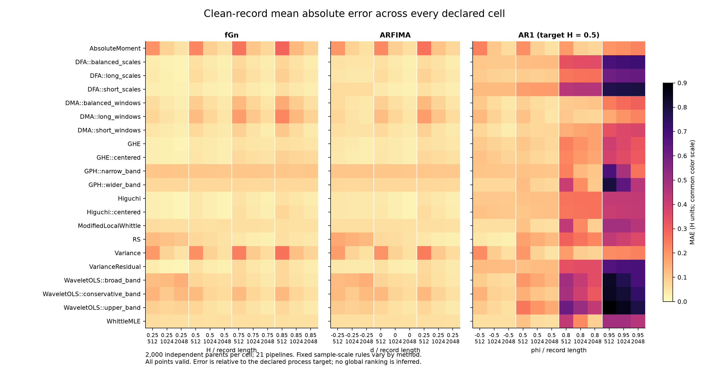
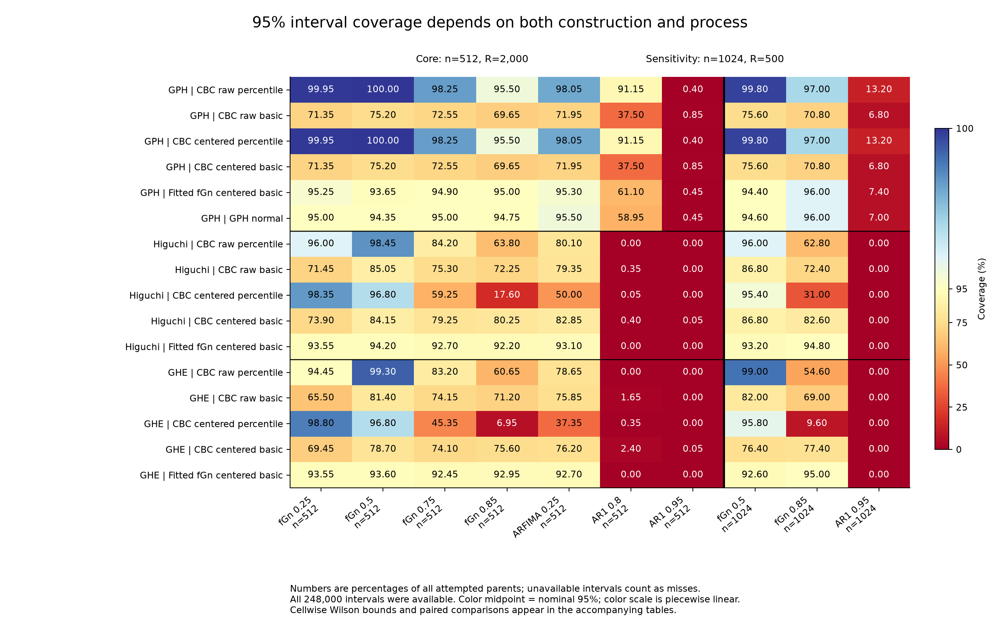

# Confirmation results and independent audit

Package 10 · 7 September 2026 · production revision `9c02d04`

The full confirmation result set passes the independent audit described below.
The findings require a substantial rewrite of the supplied draft: point accuracy
depends on the process and scale rules, removing a sample mean has distinct costs
and benefits, and numerical interval availability does not establish coverage.

## What was verified

| Quantity | Audited total |
| --- | ---: |
| Committed chunks | 2,079 |
| Independent clean parents | 66,000 |
| Separately contaminated descendants | 161,000 |
| Point fits / valid point fits | 4,767,000 / 4,767,000 |
| Interval parents, selected from clean parents | 15,500 |
| Interval comparisons / available intervals | 248,000 / 248,000 |
| Physical bootstrap records | 61,969,000 |
| Statistic attempts / finite statistics | 278,860,500 / 278,860,500 |
| Failed / invalid / unattempted statistic positions | 0 / 0 / 0 |
| Cell and domain summary rows | 118,917 |

There are 33 accuracy cells (2,000 parents each), 14 stress cells (the first 500
parents of each eligible accuracy cell) and 10 interval cells. Seven interval
core cells have 2,000 parents each at n=512; three length-sensitivity cells have
500 each at n=1024. The 21 point pipelines comprise 19 audited configurations
from 12 base algorithms plus sample-centered Higuchi and GHE variants.
The 23 contaminations are applied separately to each selected clean parent.

The independent audit imports no producer reader, interval builder or summary
function. It checks all chunk files, signals, seed derivations, parent links,
method settings, analyzed-input hashes and target labels; replays all 161,000
contaminations; inspects every aligned within-record statistic; and reconstructs
all 248,000 interval endpoint pairs. It also checks that the original interval
statistics agree with the corresponding point-study estimates.

All 98,304 cell summary values, paired contrasts, support
counts and applicable Monte Carlo standard errors are independently reconstructed.
Literal parent gathering reproduces 3,047,424
entries at 31 predetermined positions in each 1,999-draw cell distribution.
All 196,509,696 stored cell-draw positions are
inspected when recalculating uncertainty and availability. Every one of the
41,205,387 domain-draw entries is recombined
from its cells, including weighted MAE ratios and RMSE. All 118,917 canonical
rows reconcile exactly after explicit parsing of numeric CSV columns.

This is an independent result audit, not a second execution of all estimator
fits or all clean simulations. Those equations and replay paths were validated
in the earlier packages. Only 31 of 1,999 cell summary resamples are independently
reconstructed from raw parents here; all saved distributions supply the separate
full interval/SE checks. Fourteen adversarial tests cover pairing, missing
intervals, nonlinear aggregation, boundary uncertainty, mixed CSV types and
deliberately corrupted summaries. The audit needed a numeric-parsing correction
for blank-containing CSV columns; this did not change any producer output.

## Clean-record accuracy is process dependent

Each domain below weights its declared process/length cells equally: 12 fGn,
9 ARFIMA and 12 AR(1) cells. The AR(1) target is its asymptotic H=0.5; strong
short-memory persistence can produce substantial finite-scale error against
that target. These are descriptive pointwise Monte Carlo intervals, without a
global composite ranking or a test of universal superiority.

| Pipeline | fGn MAE [95% MC interval] | ARFIMA MAE [95% MC interval] | AR(1) MAE [95% MC interval] |
| --- | --- | --- | --- |
| AbsoluteMoment | 0.1392 [0.1376, 0.1409] | 0.1275 [0.1258, 0.1293] | 0.1455 [0.1440, 0.1469] |
| DFA::balanced_scales | 0.0415 [0.0411, 0.0419] | 0.0459 [0.0454, 0.0464] | 0.3188 [0.3181, 0.3196] |
| DFA::long_scales | 0.0488 [0.0482, 0.0492] | 0.0490 [0.0485, 0.0496] | 0.2646 [0.2638, 0.2654] |
| DFA::short_scales | 0.0352 [0.0348, 0.0355] | 0.0458 [0.0454, 0.0463] | 0.3876 [0.3870, 0.3882] |
| DMA::balanced_windows | 0.0744 [0.0737, 0.0752] | 0.0668 [0.0660, 0.0676] | 0.1284 [0.1276, 0.1291] |
| DMA::long_windows | 0.1001 [0.0991, 0.1010] | 0.0860 [0.0850, 0.0870] | 0.1132 [0.1124, 0.1141] |
| DMA::short_windows | 0.0541 [0.0535, 0.0547] | 0.0545 [0.0539, 0.0551] | 0.1629 [0.1622, 0.1635] |
| GHE | 0.0411 [0.0407, 0.0415] | 0.0410 [0.0406, 0.0415] | 0.1858 [0.1853, 0.1863] |
| GHE::centered | 0.0500 [0.0495, 0.0505] | 0.0460 [0.0455, 0.0465] | 0.1803 [0.1798, 0.1808] |
| GPH::narrow_band | 0.1067 [0.1056, 0.1078] | 0.1061 [0.1050, 0.1073] | 0.2124 [0.2111, 0.2136] |
| GPH::wider_band | 0.0717 [0.0711, 0.0724] | 0.0710 [0.0702, 0.0718] | 0.2577 [0.2568, 0.2586] |
| Higuchi | 0.0342 [0.0338, 0.0345] | 0.0374 [0.0370, 0.0378] | 0.2265 [0.2260, 0.2269] |
| Higuchi::centered | 0.0388 [0.0385, 0.0392] | 0.0402 [0.0397, 0.0406] | 0.2239 [0.2235, 0.2243] |
| ModifiedLocalWhittle | 0.0571 [0.0565, 0.0576] | 0.0567 [0.0560, 0.0573] | 0.2147 [0.2141, 0.2154] |
| RS | 0.0650 [0.0646, 0.0654] | 0.0807 [0.0803, 0.0811] | 0.2109 [0.2105, 0.2113] |
| Variance | 0.1279 [0.1263, 0.1294] | 0.1186 [0.1169, 0.1203] | 0.1448 [0.1434, 0.1461] |
| VarianceResidual | 0.0402 [0.0398, 0.0406] | 0.0430 [0.0425, 0.0434] | 0.3185 [0.3178, 0.3191] |
| WaveletOLS::broad_band | 0.0775 [0.0768, 0.0783] | 0.0876 [0.0866, 0.0886] | 0.3561 [0.3553, 0.3570] |
| WaveletOLS::conservative_band | 0.0965 [0.0955, 0.0975] | 0.0990 [0.0979, 0.1002] | 0.3534 [0.3522, 0.3546] |
| WaveletOLS::upper_band | 0.0616 [0.0610, 0.0623] | 0.0677 [0.0669, 0.0685] | 0.4109 [0.4101, 0.4118] |
| WhittleMLE | 0.0573 [0.0568, 0.0579] | 0.0568 [0.0562, 0.0575] | 0.2150 [0.2143, 0.2156] |

The corrected geometric implementations no longer support the draft's saturation
and constant-anchor account. At n=512, mean Higuchi estimates are 0.2469 and
0.8347 for fGn H=0.25 and H=0.85; GHE means are 0.2467 and 0.8320. The historical
implementation defects remain documented as defects of those versions.

## Mean removal solves the offset control but not internal steps

Sample centering raises average clean fGn/ARFIMA MAE for these geometric pipelines
and slightly reduces it over the AR(1) grid. The following are the predeclared
paired centered-minus-raw contrasts; positive values mean higher MAE.

| Method | Centered minus raw clean MAE, fGn | ARFIMA | AR(1) |
| --- | --- | --- | --- |
| Higuchi | 0.0047 [0.0044, 0.0050] | 0.0028 [0.0025, 0.0031] | -0.0026 [-0.0027, -0.0024] |
| GHE | 0.0089 [0.0085, 0.0093] | 0.0050 [0.0046, 0.0053] | -0.0055 [-0.0057, -0.0052] |

For the fGn stress domain (eight process/length cells, 500 paired parents each),
the examples below report MAE increase relative to the matched clean subset.
The constant offset is one clean sample SD; the internal step is two clean
sample SDs at the midpoint. They are different interventions. Sample centering
removes the constant-offset effect to floating-point precision, while substantial
step-related error remains. These examples illustrate the complete 23-condition
tables, which retain all methods and all cells.

| Method | Constant offset: raw | Constant offset: centered | Midpoint step of 2 SD: raw | Midpoint step of 2 SD: centered |
| --- | --- | --- | --- | --- |
| Higuchi | 0.3408 [0.3396, 0.3419] | < 10⁻¹² (roundoff) | 0.3144 [0.3134, 0.3154] | 0.3304 [0.3293, 0.3315] |
| GHE | 0.3395 [0.3382, 0.3407] | < 10⁻¹² (roundoff) | 0.3136 [0.3125, 0.3147] | 0.3198 [0.3185, 0.3210] |

Absolute estimate drift is exported separately from MAE increase. A method can
move substantially while its mean absolute error changes little; these quantities
must not share a pooled score, axis or caption. The stress target is latent clean
recovery, not an assertion that the contaminated record has the clean process H.

## Available intervals can be severely miscalibrated

All 248,000 interval comparisons are available, and all 278,860,500 requested
statistic positions are finite. At fGn H=0.85 and n=512, however, unconditional
coverage varies markedly. Each estimate below uses 2,000 independent parents;
brackets are 95% Wilson intervals for the coverage proportion.

| Method | CBC raw percentile | CBC centered percentile | CBC centered basic | Fitted-fGn centered basic |
| --- | --- | --- | --- | --- |
| GPH::narrow_band | 95.50% [94.50, 96.32] | 95.50% [94.50, 96.32] | 69.65% [67.60, 71.63] | 95.00% [93.96, 95.87] |
| Higuchi | 63.80% [61.67, 65.88] | 17.60% [15.99, 19.33] | 80.25% [78.45, 81.94] | 92.20% [90.94, 93.30] |
| GHE | 60.65% [58.49, 62.77] | 6.95% [5.92, 8.15] | 75.60% [73.67, 77.43] | 92.95% [91.74, 93.99] |

The GPH normal comparator covers 94.75% [93.68, 95.64]. Switching from centered CBC basic
to fitted-fGn centered basic increases coverage by 11.95 percentage points [10.55, 13.45] for
Higuchi and 17.35 percentage points [15.70, 19.00] for GHE in this cell; these are paired Monte Carlo
intervals. Even the fitted-fGn geometric intervals retain some undercoverage.
The complete cellwise table is required: nominal-looking performance in one
cell does not establish calibration across the grid.

The model-mismatch controls are decisive. For AR(1) phi=0.8 or 0.95 at n=512,
the fitted-fGn Higuchi and GHE intervals cover H=0.5 in 0/2,000 parents per
method/cell (Wilson upper bound 0.192%). At n=1024, phi=0.95, they cover 0/500
(upper bound 0.762%). The fitted-fGn optimizer reaches its declared boundary
region in 1,971/2,000 phi=0.8 core parents, all 2,000 phi=0.95 core parents,
and all 500 phi=0.95 sensitivity parents. These fits are retained and flagged.
Completion of the optimizer is not evidence that the fGn model represents these
short-memory controls adequately. No fitted-model interval is a universal remedy.

The interval study includes GPH, Higuchi and GHE on clean records. It supplies
no confirmation evidence about DFA interval coverage or coverage under
contamination. H>=0.6 remains an exceedance diagnostic, not a calibrated LRD test
or an estimate of a nominal 5% false-positive rate.

## Consequences for the paper

The draft's main rankings, counts, saturation conclusions, coverage-collapse
tables, false-positive claims and EEG-validation claims must be replaced.
The eight old observational records were software fixtures. This confirmation
supports a synthetic benchmark of memory/scaling estimates with explicit
model-mismatch and contamination controls; it does not establish clinical,
biomarker, criticality or empirical EEG validity.

The next phase is a manuscript rebuild using this one result set: retitle and
rewrite the abstract; replace Methods with the frozen design and explicit
estimands; replace Results figures/tables; rewrite Discussion around the observed
tradeoffs; and audit every remaining numeric claim. The original draft PDF stays
preserved. The [claim replacement ledger](confirmation_audit/results/draft_claim_ledger.csv)
records the disposition of the major legacy claims.

## Reproducible artifacts

* [Audit specification and limits](confirmation_audit/README.md)
* [Machine-readable audit evidence](confirmation_audit/results/audit_evidence.json)
* [Cell accounting and model-boundary counts](confirmation_audit/results/cell_accounting.csv)
* [All clean MAEs with Monte Carlo intervals](confirmation_audit/results/accuracy_mae.csv)
* [All cell/domain coverage values and uncertainty](confirmation_audit/results/interval_coverage.csv)
* [Every stress condition's domain effects](confirmation_audit/results/stress_effects_domains.csv)
* Full metric and contrast tables: `confirmation_audit/results/{accuracy,stress,intervals}_{cells,domains}.csv.gz`
* [All planned contrasts](confirmation_audit/results/planned_contrasts.csv.gz)
* [Exact source rows for narrative examples](confirmation_audit/results/narrative_evidence.csv)
* [Export checksums](confirmation_audit/results/export_provenance.json)

Run identity: `43d0a7f75c8afab6d32ab6fd1f2ff8db49cca59e36971e2b74404173f4cbfcf2`. Scientific design:
`b5b9399d284e3fae8135050aeac5c8bc0a02ab36b4f0a6d15041f55a497681bb`. The frozen runtime and production archive
remain outside OneDrive; this audit changes neither. Figures are provided as
PNG and editable SVG. CSV values are unrounded; prose and figures round only
for presentation.
