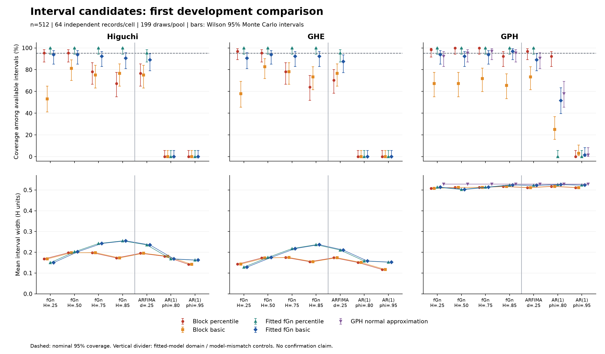

# First comparison of interval alternatives

This is an exploratory development comparison, separate from confirmation and
from the earlier two-record cost profile. Its purpose is to test whether interval
construction and the resampling model can explain the geometric methods' observed
undercoverage. No interval is accepted for general use on the basis of this screen.

## Findings

The fitted-fGn basic interval improves coverage for persistent fGn, while failure
under short-memory controls remains severe. Coverage is conditional on availability;
all 5,824 intervals were available in this run, so its denominator is 64 in every
cell/configuration. The principal comparison is:

| Process | Method | Block percentile | Fitted-fGn basic | Width: block / fGn basic |
| --- | --- | ---: | ---: | ---: |
| fGn H=0.75 | Higuchi | 50/64 (78.1%) | 59/64 (92.2%) | 0.198 / 0.242 |
| fGn H=0.75 | GHE q=1 | 50/64 (78.1%) | 59/64 (92.2%) | 0.175 / 0.218 |
| fGn H=0.85 | Higuchi | 43/64 (67.2%) | 58/64 (90.6%) | 0.173 / 0.255 |
| fGn H=0.85 | GHE q=1 | 41/64 (64.1%) | 59/64 (92.2%) | 0.155 / 0.237 |
| ARFIMA d=0.25 | Higuchi | 49/64 (76.6%) | 57/64 (89.1%) | 0.195 / 0.236 |
| ARFIMA d=0.25 | GHE q=1 | 45/64 (70.3%) | 56/64 (87.5%) | 0.174 / 0.211 |
| AR(1), phi=0.8 or 0.95 | Both geometric methods | 0/64 | 0/64 | See full table |

For both geometric methods at H=0.75, the paired gain is 14.1 percentage points,
with Monte Carlo SE 4.38 points. At H=0.85, the gains are 23.4 points for Higuchi
(SE 5.34) and 28.1 points for GHE (SE 5.66). These are exploratory paired
comparisons, without a confirmatory multiplicity decision. The Wilson interval
for 59/64 coverage is about 83.0–96.6%; 58/64 gives 81.0–95.6%. The experiment
therefore does not establish a narrow tolerance around 95%.

The lower-H cells matter: fitted-fGn basic coverage is 93.8% for Higuchi at both
H=0.25 and 0.5, and 90.6% / 93.8% for GHE. The corresponding block percentile
coverage was 95.3% / 95.3% and 96.9% / 95.3%. The model-based candidate improves
the persistent cases at the cost of lower empirical coverage elsewhere; it must
be assessed across its entire intended domain.

Simply reversing block-bootstrap errors is not a reliable correction. At H=0.25,
block-basic coverage falls to 53.1% for Higuchi and 57.8% for GHE. The fitted-fGn
percentile construction covers 64/64 in every fGn cell for all three methods.
That is conservative-looking behaviour, not evidence of superior 95% calibration.
Its intervals have exactly the same widths as fitted-fGn basic intervals within
each record; their different centres cause the coverage difference.

GPH's normal approximation covers 59, 61, 62 and 61 of 64 fGn records as H
increases, with width 0.529. It merits further development assessment alongside
the bootstrap candidates, but its AR(1) coverage is only 37/64 at phi=0.8 and
1/64 at phi=0.95. A wide or apparently well-calibrated interval in fGn does not
remove short-memory contamination bias.

The fGn fit hits its upper H=0.99 bound in 63/64 AR(1) records at phi=0.8 and
64/64 at phi=0.95. No fGn or ARFIMA record hits a bound. The mean fitted H for
ARFIMA is 0.702 despite its asymptotic target H=0.75. These diagnostics expose
the incompatibility of a single pure-fGn model with the full comparison domain.
All model fits and intervals are retained to make that failure visible; boundary
hits are not used retrospectively to improve coverage by discarding records.



All [coverage rows](interval-pilot/coverage_summary.csv),
[paired comparisons](interval-pilot/paired_comparisons.csv) and
[fitted-model diagnostics](interval-pilot/fitted_models.csv) are preserved.
Full bootstrap-statistic draws and the checkpoint database remain in the separate
local verification directory. No empirical EEG inference or formal LRD test is
performed by this comparison.

## Fixed design

The [configuration](interval-comparison.json), written before execution, uses
n=512, 64 independent records per cell, 199 bootstrap draws per record and pool,
and central 95% intervals. The seven cells are fGn H=0.25, 0.5, 0.75 and 0.85;
exact stationary ARFIMA(0,0.25,0); and stationary AR(1) with phi=0.8 and 0.95.
The latter three cells test model mismatch. AR(1)'s H=0.5 target is an asymptotic
short-memory reference, not its finite-scale apparent slope.

GPH uses m=32 and no taper. Higuchi uses k_max=32. GHE uses q=1 and maximum lag
32. Both geometric methods integrate the supplied increments with a zero origin
and no sample demeaning. These settings are fixed across cells. The new seed
namespace separates this comparison from earlier development inputs.

Every method receives the same clean input. All methods also share the same
bootstrap records within a pool. Two interval constructions reuse each pool's
statistic draws; they do not represent independent simulations. The planned
accounting is 448 clean records, 1,344 point-statistic evaluations, 448 model fits,
178,304 generated bootstrap records, 534,912 bootstrap-statistic attempts, and
5,824 interval rows. All failed or unavailable results remain in the denominators.

## Interval constructions and assumptions

Write T for the point statistic and q_p for the empirical p-quantile of bootstrap
statistics T*. The circular-block pool uses block length floor(n/16)=32. For each
method it supplies both:

- `cbc_percentile`: [q_0.025, q_0.975], the existing interval construction.
- `cbc_basic`: [2T - q_0.975, 2T - q_0.025], reversing estimated errors around T.

For the parametric pool, first fit a stationary Gaussian fGn model with **known
zero mean**, unknown H, and unknown marginal variance. Let H_fit be its fitted
parameter. Independent length-n records are then generated from its full fitted
covariance, without truncation, block joins or diagonal jitter. Each method's
original statistic is recomputed on every generated record. This gives:

- `fgn_percentile`: [q_0.025, q_0.975].
- `fgn_basic`: [T + H_fit - q_0.975, T + H_fit - q_0.025].

The latter uses the bootstrap error T* - H_fit. **H_fit need not equal T.**
Replacing H_fit by T would give a different interval and lose the intended
model-based error centering. The plug-in model is fitted from the observed series;
the fitting and interval functions receive no benchmark truth. The point estimate
is not replaced by the model fit. No interval endpoint or point is clipped to [0,1].

This follows the parametric error-pivot principle in
[Orloff and Bloom's MIT bootstrap notes, section 10](https://ocw.mit.edu/courses/18-05-introduction-to-probability-and-statistics-spring-2022/mit18_05_s22_class24-prep.pdf).
That principle does not establish validity for this specific dependent statistic.
The notes' worked code uses 0.05/0.95 quantiles despite describing 95% coverage;
we independently use tails (1-0.95)/2=0.025 and test the endpoint algebra directly.

The fGn likelihood profiles variance analytically. With covariance sigma² R(H),
Q=x'R(H)^(-1)x and zero mean, sigma²_fit=Q/n. The profiled objective, up to
constants, is n log(Q/n)+log|R(H)|. Cholesky and triangular solves evaluate it,
following the Gaussian likelihood calculation in
[Rasmussen and Williams, equation 2.30 and algorithm 2.1](https://gaussianprocess.org/gpml/chapters/RW2.pdf).
An 11-point H grid brackets a bounded scalar minimization over [0.01,0.99];
endpoints compete with the interior solution and boundary hits are recorded.
The optimization is checked against a separately implemented joint Gaussian
optimization over H and variance, and the objective against eigendecomposition.

The known-zero-mean assumption is appropriate to the declared simulation model;
it is a substantive restriction for application. No unknown-mean or preprocessing
claim is established here. In particular, the fGn intervals cannot be assumed
valid for ARFIMA, short-memory AR structure, contaminated data or empirical EEG.

GPH additionally receives `gph_ols_normal`. For regressor
z_j=log(4 sin²(pi*j/n)), the working log-periodogram error variance pi²/6 gives
SE=sqrt(pi²/[6 sum_j(z_j-z_bar)²]). Use T +/- z_0.975*SE, without tapering.
This retains the actual finite regression design; its large-m limit is
pi²/(24m) for the variance. See
[Sun and Phillips, theorem 5 and section 5](https://econweb.ucsd.edu/~yisun/pfp.pdf)
for the log-periodogram asymptotic variance and the role of bias. This is a normal
approximation under spectral regularity assumptions, not a finite-sample guarantee.
An independent log-exponential regression simulation checks the working variance.

## Computational change

Higuchi's inner offset loop is replaced by grouping lag-k absolute differences by
their starting index modulo k. Each group's original term count and normalization
are retained. An independent direct sum checks 24 length/lag combinations, each
on noise, an integrated path and a deterministic curved path. The version advances
to 0.3.0 because floating-point summation order changes. Previous source-specific
checkpoints remain archived; new source hashes require new output directories.

The interval candidates are research helpers. Package default confidence intervals
and the public result-store columns are unchanged. The new runner reuses the
shared pool, source/environment checks and single-writer protection; it checkpoints
an entire record with all shared draws and intervals in one transaction. This
preserves the pairing after interruption. Bootstrap failures are counted once per
method and pool, not twice because percentile and basic intervals share draws.

Against the preceding committed implementation (`beb097a`), a separate timing
check on 40 integrated-noise paths per length and four alternating timing passes
found Higuchi about 4.7x faster at n=512, 4.3x at n=1024 and 3.5x at n=2048.
Maximum dimension differences were 6.7e-16. See the
[timing measurements](interval-pilot/higuchi_timing.csv). These are statistic-level
timings, not whole-experiment speed-ups. The fourth package's 13-hour projection
describes the earlier implementation and must not be reused for the new code
without profiling the retained interval procedures.

## Reproduction and next decisions

Verification in the locked Python 3.14.5 environment passed **384 tests**, with
8 optional-dependency skips: all unit tests, statistical tests and the targeted
stress integration module. The 39 new candidate tests include direct equation,
likelihood, covariance, endpoint, failure-accounting and checkpoint checks. The
small ground-truth/stress/observational-fixture workflows each reproduce exactly
on repetition and pass the public output contract. Type checking passes for all
57 package source files with the Python 3.14 target; Ruff passes. No full
integration-suite or new Python 3.11 environment pass is claimed.

All 448 input hashes match, all 534,912 bootstrap-statistic attempts are retained,
and all 20 historical baseline hashes remain unchanged. The first four record
checkpoints are unchanged after resuming; a final resume computes zero new records.
The coverage/width figure was visually checked, including the wider GPH intervals.
The [verification record](interval-pilot/verification.json) preserves evidence and
source/environment hashes. Availability of all intervals is not calibration.

Use the locked Python 3.14.5 environment from the fourth package. No new dependency
is required. Preview the counts before running, using a new output directory:

```console
python benchmark_experiment/remediation/run_interval_comparison.py --dry-run
python benchmark_experiment/remediation/run_interval_comparison.py --output reports/interval-comparison
```

The same command resumes the run. `--max-new-records` permits a bounded stop.
Each record retains model diagnostics, full bootstrap-statistic draws, pool seeds,
failures and all interval endpoints. Summaries include availability, conditional
coverage, Wilson Monte Carlo intervals and widths. Comparisons against the block
percentile baseline use matched records and paired Monte Carlo standard errors.

At 64 records, near 95% coverage the binomial Monte Carlo standard error is about
2.72 percentage points. This screen can expose severe failure; it cannot establish
a narrow calibration tolerance. Candidate settings must subsequently be fixed
using development data and assessed with fresh confirmation records. Selection
must consider every declared scenario and model assumptions, not a favourable
pooled average or a single nearly nominal cell.

The next development decision is to retain fitted-fGn basic as a **model-specific
candidate** and GPH normal as an **asymptotic candidate**, then examine multiple
record lengths, more independent repetitions and bootstrap-tail stability. The
ARFIMA and AR controls remain visible stress tests of those assumptions. A broader
parametric family or a justified semiparametric procedure is needed before making
an uncertainty claim spanning short-range structure. Unknown means and chosen
preprocessing must be addressed explicitly. No paper-wide default or final
acceptance threshold is selected from these pilot outcomes.
