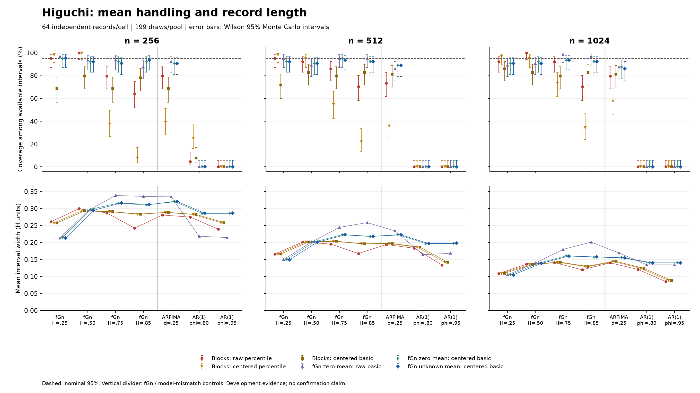

# Record length and unknown-mean development comparison

This sixth remediation package separates mean removal in the statistic from
mean estimation in the fitted bootstrap model. It is a development screen, not
the confirmation experiment and not a change to package defaults. The original
paper and earlier result bundles remain historical evidence.

## Design fixed before inspecting this screen

The [configuration](mean-comparison.json) declares 21 cells: n = 256, 512, 1024;
fGn H = 0.25, 0.50, 0.75, 0.85; stationary ARFIMA(0, d, 0) d = 0.25; and
stationary AR(1) phi = 0.80, 0.95. There are 64 independent records per cell and
199 bootstrap draws per pool, using a new development seed namespace. All
candidates use the same clean parents. These are zero-mean generators; the
unknown-mean pipeline is deliberately denied knowledge of that mean.

GPH uses 32 untapered frequencies. Higuchi uses lags 1–32; GHE uses q = 1 and
lags 1–32. For geometric methods, increments are integrated with an initial
zero. The raw pipeline integrates the observed increments directly; the centered
pipeline first subtracts their arithmetic mean. The centered path consequently
ends at zero. That finite-record constraint can change bias and must be tested.
Lag settings are held fixed in samples, not physical time or relative bandwidth.
GPH already demeans internally, so its raw/centered point estimates and normal
intervals should coincide to round-off. Holding its frequency count at 32 changes
the relative frequency band as n increases; this is not a bandwidth-matched test.

For each method the six bootstrap candidates are:

| Candidate identifier | Statistic | Resampling model | Interval |
| --- | --- | --- | --- |
| `cbc_percentile` | Raw | Circular blocks of floor(n/16) | Percentile |
| `zero_raw_basic` | Raw | Fitted fGn, mean known as zero | Basic |
| `cbc_centered_percentile` | Centered | Same circular-block draws | Percentile |
| `cbc_centered_basic` | Centered | Same circular-block draws | Basic |
| `zero_centered_basic` | Centered | Same fitted zero-mean fGn draws | Basic |
| `unknown_centered_basic` | Centered | Fitted fGn, unknown constant mean | Basic |

GPH additionally retains the normal approximation for both transformations.
Centering is repeated on **each bootstrap record**. The Gaussian models share
random innovations for their paired comparison, but produce distinct physical
draw pools. A pool's draws are reused across methods and transformations;
percentile/basic constructions reuse the resulting statistic distribution.
The model-based basic pivot is T(x) - quantiles(T* - fitted H). Neither H truth
nor the generating process label enters a model fit or statistic. Estimates and
interval endpoints are not clipped to [0, 1].

The declared workload is 1,344 independent records, 2,688 model fits, 8,064
original point statistics, 8,064 offset-probe statistics, 802,368 physical
bootstrap records, 4,011,840 bootstrap-statistic attempts and 26,880 intervals.
Additional candidates or transformations do not increase independent replication.
Near 95% coverage the cell-level Monte Carlo SE remains about 2.72 percentage
points. No narrow calibration tolerance or pass/fail threshold is inferred from
this screen. n = 2048 and bootstrap-tail stability remain subsequent work.

## Unknown-mean likelihood and offset check

For covariance sigma² R(H), the fitted constant mean is
mu(H) = (1' R(H)^-1 x)/(1' R(H)^-1 1). Let Q(H) be the residual quadratic form
(x - mu(H)1)' R(H)^-1 (x - mu(H)1). Profiling the variance gives sigma² = Q/n;
we minimize n log(Q/n) + log|R(H)|. These are ordinary Gaussian maximum-likelihood
equations, not REML. This follows Chang's unknown-mean/unknown-variance case,
equations 23–24. The implementation uses Cholesky solves, not an explicit inverse.
The earlier known-zero fit is retained for the controlled comparison.
[Chang (2014), primary article](https://pdfs.semanticscholar.org/eec0/2b82e41d188b9366de5b7855ed374f78328c.pdf).

H is searched on [0.01, 0.99] using an 11-point grid followed by a bounded local
search around the best grid location; boundary hits and failures are reported.
The arithmetic mean in the statistic differs from the GLS mean in the model.
The model is fitted once per original record. Bootstrap records re-estimate the
arithmetic mean used by T; they do not refit the generating likelihood because
the reported statistic is GPH/Higuchi/GHE, not the model MLE.

Every parent also receives a paired +1 constant offset in input units, and both
point pipelines are reevaluated. These probes are deterministic descendants,
not additional independent simulations. Centered T is translation invariant in
exact arithmetic. The profiled unknown-mean model shifts its fitted mean by the
offset while preserving H and variance, so the centered parametric interval is
also invariant with matched innovations. Tests check this full interval property
numerically. The population coverage screen is run once at zero generating mean;
the offset probes are point-sensitivity checks, not a second CI-coverage study.
Constant offsets do not test trends, steps, oscillations or model misspecification.

## Reproduction and output interpretation

Use the existing locked Windows/Python 3.14 environment; no new dependency is
required. Preview the full workload and choose a new output directory:

```console
python benchmark_experiment/remediation/run_mean_comparison.py --dry-run
python benchmark_experiment/remediation/run_mean_comparison.py --output reports/mean-comparison
```

The same command resumes after a stop; `--max-new-records` permits a bounded
checkpoint. Source/environment/configuration hashes guard resumption. Record
payloads retain all finite bootstrap-statistic draws, failures, fitted models,
offset probes and interval endpoints. CSVs are research exports outside the
package's public output contract. The shared checkpoint engine also supports
the fifth package's unchanged experiment design.

Summaries retain per-cell coverage, interval availability, Wilson Monte Carlo
intervals, widths, bias and MAE. Paired comparisons use parent IDs, including
missing-pair counts. `mean_model_comparisons.csv` contrasts unknown-mean versus
known-zero fitting with sample centering held fixed. All process controls remain
visible; a fitted fGn model is not presumed valid for ARFIMA or AR(1).

## Results and verification

The full screen completed **1,344 independent records in 21 cells**, with all
26,880 intervals available. All 4,011,840 bootstrap-statistic attempts were used;
none were invalid or failed. There were 802,368 physical bootstrap records and
2,688 successful model fits. This is complete execution of the declared
development screen, not confirmation of calibration.

**Centering changes both the point estimator and its uncertainty problem.** At
fGn H = 0.85, n = 256, Higuchi's mean point bias changes from -0.0222 to -0.0992
and GHE's from -0.0184 to -0.0893 after sample centering. The raw block-percentile
interval covers 41/64 and 40/64 records respectively. Applying the centered
statistic inside that same block-percentile construction drops coverage to
**5/64 and 6/64**. Centered block-basic improves to 50/64 and 48/64, but this does
not resolve the problem. Removing an unknown mean is not a stand-alone CI fix.

The fitted-fGn basic construction behaves differently: its centered,
unknown-mean version covers 60/64 records for both geometric methods in that
condition. The interval corrects the bootstrap error distribution; it does not
replace or remove the point estimate's bias. Its mean widths are 0.3116 for
Higuchi and 0.2749 for GHE, versus raw block-percentile widths of 0.2423 and
0.2108. The paired coverage gains against that baseline are 29.69 and 31.25
percentage points, with paired Monte Carlo SEs of 6.93 and 7.00 points.

The following are **covered records out of 64**, with the same parents across
columns. The [complete coverage table](mean-pilot/coverage_summary.csv) contains
all candidates, lower-H cases, controls, Wilson intervals, widths and point errors.

| H | n | Method | Block percentile, raw | fGn basic, zero mean/raw | fGn basic, zero mean/centered | fGn basic, unknown mean/centered |
| --- | --- | --- | --- | --- | --- | --- |
| 0.75 | 256 | Higuchi | 51 | 60 | 59 | 58 |
| 0.75 | 256 | GHE | 49 | 60 | 60 | 61 |
| 0.75 | 512 | Higuchi | 55 | 61 | 61 | 60 |
| 0.75 | 512 | GHE | 52 | 63 | 61 | 61 |
| 0.75 | 1024 | Higuchi | 59 | 63 | 60 | 60 |
| 0.75 | 1024 | GHE | 60 | 62 | 60 | 60 |
| 0.85 | 256 | Higuchi | 41 | 56 | 59 | 60 |
| 0.85 | 256 | GHE | 40 | 55 | 59 | 60 |
| 0.85 | 512 | Higuchi | 45 | 61 | 59 | 59 |
| 0.85 | 512 | GHE | 44 | 59 | 59 | 59 |
| 0.85 | 1024 | Higuchi | 45 | 62 | 59 | 59 |
| 0.85 | 1024 | GHE | 44 | 62 | 60 | 59 |

Across all twelve fGn cells, unknown-mean/centered basic coverage ranges from
58–61/64 (90.6–95.3%) for each geometric method and 57–64/64 for GPH. Estimating
the model mean adds no uniform coverage advantage over the known-zero fit with
centering held fixed; see the [paired model comparison](mean-pilot/mean_model_comparisons.csv).
The centered procedure provides a declared way to handle unknown constant means,
not a universally better estimator or an accepted narrow calibration guarantee.

**Model mismatch remains consequential.** Both geometric unknown-mean/centered
intervals cover 0/64 on every AR(1) condition at every tested length. Their ARFIMA
coverage ranges from 54–59/64. With GPH's fixed 32-frequency rule, unknown-mean
basic coverage on AR(1) phi = 0.8 rises from 5/64 to 37/64 to 60/64 as n increases;
on phi = 0.95 it is only 0/64, 1/64 and 2/64. These are model/length-specific
observations, not a general LRD test. Each Gaussian fit variant hits the declared
H boundary in 366 of 384 AR(1) records; neither variant hits it on fGn or ARFIMA.
All boundary and optimizer diagnostics are retained in
[fitted_models.csv](mean-pilot/fitted_models.csv).

The paired +1 offset probe leaves all centered point estimates unchanged to at
most 1.89e-15 H units. A separate full-pipeline test confirms translation
invariance for the unknown-mean/centered interval. The known-zero model is still
a known-zero assumption even when its downstream statistic is centered.
The [paired-summary report](paired-summary.md) documents the new parent-resampling
helper and its application to these offset descendants. Those summary intervals
describe uncertainty across independent records, not uncertainty in one H fit.

### Figures and reproducibility

The [Higuchi figure](mean-pilot/mean_comparison_higuchi.png),
[GHE figure](mean-pilot/mean_comparison_ghe.png) and
[GPH figure](mean-pilot/mean_comparison_gph.png) display coverage and width at each
length, retaining the mismatch controls. All three were visually checked for
readable labels, complete legends and unclipped ranges.



Verification passed **411 tests with 8 optional-dependency skips**, across the
398-test unit/statistical/targeted-stress run and 13 subsequent paired-summary
tests. The 27 new tests cover independent Gaussian likelihood calculations,
joint optimization, mean/scale equivariance, per-draw mean removal, failure
accounting, resumption, shared-parent sampling, fixed weights and ratio semantics.
The fifth package's small runner still reproduces after the shared execution
refactor. Repository-wide Ruff and formatting of changed code pass. No new
public estimator setting or output-contract column was introduced.

The independent bundle audit verified all 1,344 input hashes, the first four
checkpoints after resumption, all bootstrap interval endpoints, coverage/width/
Wilson summaries, paired differences and draw accounting. A final resume computed
zero new records. All 20 historical baseline hashes remain unchanged. The
[verification record](mean-pilot/verification.json) includes artifact hashes, and
[record_checksums.csv](mean-pilot/record_checksums.csv) identifies every saved
record payload. The complete local bundle is in `mean-candidate-verification`
beside the repository, including inputs, checkpoints and all statistic draws.

[executed_sources.zip](mean-pilot/executed_sources.zip) preserves the exact bytes
of all 64 fitted-run/paired-summary source files named by the source manifests.
This also preserves existing Windows line endings that differ from Git's text
normalization. Use this snapshot when exact historical source-byte identity is
needed; the dependency lock remains the fourth package's Windows/Python 3.14 lock.
Summed per-record fitting time is about 30 minutes on this machine; this excludes
input generation, exports and verification and is not a confirmation-run estimate.

Rebuild the additional artifacts after a completed run:

```console
python benchmark_experiment/remediation/plot_mean_comparison.py --input reports/mean-comparison/coverage_summary.csv --output reports/mean-comparison
python benchmark_experiment/remediation/summarize_offset_probe.py --output reports/mean-comparison
```

`verify_mean_comparison.py` audits this completed evidence bundle, including its
four-record checkpoint snapshot and the two saved JUnit reports, and copies a
compact archive. These verification inputs are required rather than inferred.

### Decision and next work

Retain explicitly named raw and centered point pipelines in the development
record. The unknown-mean/centered basic interval remains an fGn-specific candidate;
the block intervals and GPH approximation remain documented comparators with
their observed failures. No general-purpose replacement is selected.

The next framework step is verified stress descendants from immutable clean
parents, connected to the tested joint summary procedure. The revised protocol
must then fix the method/mean-handling rules, scale choices, primary contrasts,
summary weights and precision budget before fresh confirmation. Longer records,
bootstrap-tail stability and larger independent samples remain unevaluated here.
A defensible benchmark can report that an interval is poorly calibrated; it does
not need to keep searching until every comparator attains nominal coverage.
