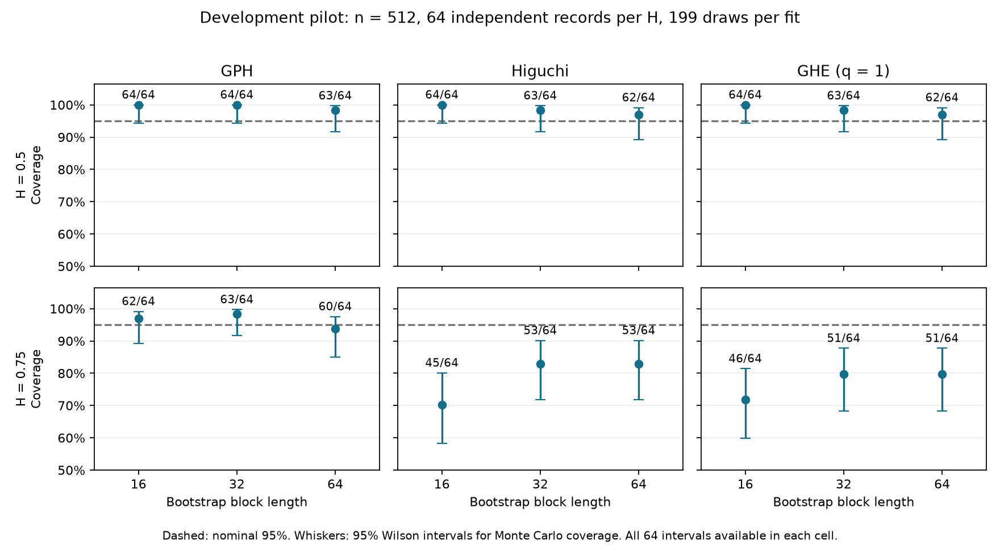

# Classical-roster audit, generator checks and broader interval pilot

7 September 2026. Third local repair package, following commit `86a4ab7`.

The first equation-check pass now covers the 12 classical method names and their
19 expanded paper configurations. This establishes what each implementation
calculates, with several repairs. It does not certify accuracy over every model,
all scale choices, or uncertainty calibration. The broader interval pilot shows
that the present geometric bootstrap intervals should remain unvalidated.

## Findings and repairs

**R18: hidden clipping.** RS, DFA, DMA, AbsoluteMoment, Variance, VarianceResidual
and the shared wavelet slope conversion silently capped H between 0.0001 and
0.9999. Their raw regression estimates now remain visible. Temporal and primary
wavelet regressions record out-of-range points and bootstrap draws. A linear trend
produces a DFA slope near 2 in the analytical check, rather than an apparently
admissible H just below 1. Model bounds remain distinct from numerical fit validity.
The constrained Whittle optimizers retain their declared d range [-0.49, 0.49]
and now report boundary hits explicitly.

**R19: undefined scaling could look valid.** A constant input produced finite
Whittle or wavelet results after positive floors were applied. Constant and
nonfinite inputs now fail explicitly; all 12 roster methods pass those checks.
An absolute amplitude cutoff in the R/S statistic was also removed so changing
units alone does not invalidate a nonconstant signal.

**R20: ARFIMA filter truncation.** The default generator is a finite moving-average
approximation to stationary ARFIMA(0,d,0). At n = 512, its 5,120-lag filter omits
0.70% of marginal variance at d = 0.3, 8.89% at d = 0.4, and 30.17% at d = 0.45.
These are exact filter-energy comparisons, not Monte Carlo estimates. A finite
filter also cannot retain infinite-lag dependence. It must be labelled an
approximation to the target process.

New ARFIMA manifests may specify `params.method: cholesky`. That option samples
the exact stationary Gaussian covariance on the requested finite grid, using the
innovation variance convention. The default `truncated_ma` retains the historical
calculation; algorithm and truncation are exported and simulation methods form
separate strata. The [truncation table](remaining-pilot/arfima_truncation.csv) records
the comparison by n and d. The underlying model is described by
[Hosking (1981)](https://doi.org/10.1093/biomet/68.1.165); its full text was inaccessible
here, so the implementation was checked independently by numerical Fourier
integration of the ARFIMA spectrum, including negative d and white noise.

The fGn/fBm checks recover the simulators' complete linear covariance maps from
basis inputs. They agree with the declared covariance plus the existing diagonal
guard of 1e-10 before sigma-squared scaling. Their provenance now names Cholesky
and the guard; invalid H and sigma values are rejected. This is covariance
factorization, not Davies–Harte. Exact Gaussian simulation methods are discussed
in [Percival and Constantine](https://faculty.washington.edu/dbp/PDFFILES/esgts.pdf).

**R21: method labels need precision.** `ModifiedLocalWhittle` implements an ordinary
Gaussian local Whittle objective, with no added nonstationary correction. Its
legacy registry name remains, but diagnostics and documentation now identify the
algorithm. `VarianceResidual` is closely related to DFA: both detrend a cumulative
profile, with differences in scale grid and residual divisor. They should not be
treated as independent methodological evidence simply because their names differ.

**R22: experimental wavelet likelihood.** Outside the paper roster, WaveletWhittle
used the wrong scale profile for its stated likelihood. For predicted variance
`c * mu_j`, its profiled scale is `sum(n_j * v_j / mu_j) / sum(n_j)`.
The correction matches an independent joint optimization over scale and H. The
method remains an approximate experimental estimator; this algebra check does not
validate its wavelet dependence assumptions. Separately, the Fourier Whittle
normalization was made consistent with its periodogram convention. The old Fourier
discrepancy was an additive constant in the profiled objective and did not change
its theoretical minimizer; it is not another factor-of-two slope defect.

## What was checked

| Method | Declared implementation and independent check |
| --- | --- |
| RS | Range of centered cumulative sums divided by population SD; vectorized range reference and Gaussian white-noise expectation. Its optional expectation-ratio normalization is not a general unbiased correction. |
| DFA | Forward disjoint blocks of a demeaned cumulative profile; polynomial residual RMS. Independent orthogonal projection agrees for detrending orders 0, 1 and 2. |
| DMA | Backward moving average of the demeaned cumulative profile; RMS across all available residuals. Explicit-window reference verifies alignment and endpoints. |
| AbsoluteMoment | Centered absolute first moment of block means, slope + 1; independent grouped-mean calculation. |
| Variance | Sample variance of block means, slope/2 + 1; independent grouped-variance calculation. |
| VarianceResidual | Sample variance of detrended profile residuals, slope/2; projection reference verifies its m/(m−1) difference from DFA's mean squared residual. |
| GPH | Exact constructed spectrum and H/d/beta transformation checks from the second package. |
| WhittleMLE | ARFIMA spectral shape on the selected low-frequency band; constructed model spectrum, independently profiled likelihood and bounded-optimizer checks. It is not exact Gaussian time-domain MLE. |
| ModifiedLocalWhittle | Ordinary local Whittle objective; recovers d from an exact power spectrum and reports constraints. |
| WaveletOLS | Earlier known-variance Haar coefficient check, plus valid/invalid input checks and the three configured bands in the point pilot. |
| Higuchi | Earlier line/Brownian dimension checks and explicit increment-to-path adapter. |
| GHE | Earlier absolute q-moment scaling and path/increment checks; the revised pilot explicitly uses q = 1. |

The original DFA construction is described in
[Peng et al. (1994)](https://journals.aps.org/pre/pdf/10.1103/PhysRevE.49.1685).
The backward-window convention is consistent with theta = 0 in
[Gu and Zhou (2010)](https://arxiv.org/abs/1005.0877). The implemented DMA uses all
valid residuals after demeaning; it is not a claim to reproduce their entire
multifractal segmentation protocol. The local Whittle name refers to the
[Gaussian semiparametric method](https://doi.org/10.1214/aos/1176324317); the exact
power-spectrum check verifies the present objective directly.

## Development pilot

[run_remaining_audit.py](run_remaining_audit.py) stores immutable shared inputs
whose seeds depend only on process, n and repetition. Adding a method or increasing
the number of repetitions preserves existing records. Source/package hashes,
per-record input hashes, parameter settings, failures and raw rows are retained.

The point screen uses all 19 configurations, 32 independent records for each of
five processes at n = 256, 512 and 1024: fGn H = 0.25/0.5/0.75, short-memory AR(1)
with coefficient 0.8, and exact Gaussian ARFIMA d = 0.3. The latter has H = 0.8
under the declared stationary model. This gives 480 independent inputs and 9,120
point fits. Input generation is independent of the framework's fGn implementation;
ARFIMA uses a direct gamma formula rather than the production covariance recurrence.

| Record length | Attempted point fits | Valid points | Out-of-range valid points |
| --- | ---: | ---: | ---: |
| 256 | 3,040 | 2,880 | 182 |
| 512 | 3,040 | 3,040 | 121 |
| 1024 | 3,040 | 3,040 | 34 |

All 160 unavailable points come from `WaveletOLS::conservative_band` at n = 256,
where its db4 wavelet and requested drops leave fewer than three levels. That
configuration needs a predeclared record-length eligibility condition. Out-of-range
points remain in error summaries. The [point summary](remaining-pilot/point_summary.csv)
contains all cells, with denominators and Monte Carlo standard errors; this screen
is too small and too limited in controls to support a universal ranking.

The interval pilot uses 64 independent records per H at n = 512, H = 0.5 and
0.75. GPH (m = 32), Higuchi (k max = 32) and GHE (q = 1, max lag = 32) use 199
resamples with block lengths 16, 32 and 64. Methods and block settings share each
record. There are 1,152 interval fits and 229,248 bootstrap attempts. The complete
input pool contains 544 unique independent records because 64 extra records extend
the two point-screen cells for this pilot.

All intervals were available. At H = 0.75, coverage remains below nominal for both
geometric methods at every tested block length:

| Block length | GPH covered / 64 | Higuchi covered / 64 | GHE covered / 64 |
| --- | ---: | ---: | ---: |
| 16 | 62 (96.9%) | 45 (70.3%) | 46 (71.9%) |
| 32 | 63 (98.4%) | 53 (82.8%) | 51 (79.7%) |
| 64 | 60 (93.8%) | 53 (82.8%) | 51 (79.7%) |

Mean widths at H = 0.75 are approximately 0.50–0.52 for GPH, 0.19 for Higuchi and
0.17 for GHE. Thus high coverage cannot be assessed without width. GPH's apparent
coverage does not certify its method over the full model domain. At H = 0.5,
coverage is 62–64/64 across configurations, still imprecise at this repetition count.
The [coverage table](remaining-pilot/coverage_summary.csv) includes Wilson 95%
intervals for Monte Carlo coverage and all denominators. These intervals do not
represent uncertainty in estimated H.



Keep Higuchi and GHE as point-estimation comparators. Their current circular-block
intervals remain unvalidated; selecting the best-looking block from this pilot
would not establish calibration. The [next experiment design](calibration-design.md)
specifies a broader grid, independent repetition targets, development/confirmation
separation, shared parents, candidate interval comparison and workload accounting.
It has not been launched as a confirmatory benchmark.

## Verification and reproduction

The final combined unit, statistical and targeted stress integration run passes
319 tests, with eight optional-dependency skips. Ruff and the strict documentation
build pass. Type checking passes for all 57 source files using Python 3.14, after
resolving the baseline typing findings and annotating the new diagnostics. The
project's default Python 3.11 target still conflicts with the installed NumPy stubs;
this is not a claim of testing a clean Python 3.11 environment.

All three small workflows repeat exactly and meet the output contract. The 20
frozen historical files still match their hashes. See
[verification.json](remaining-pilot/verification.json) for counts and provenance.
No full integration-suite or all-environment pass is claimed.

```console
python benchmark_experiment/remediation/run_remaining_audit.py --output reports/remaining-audit --calibration-pilot
python benchmark_experiment/remediation/plot_calibration_pilot.py reports/remaining-audit
pytest -q tests/unit tests/statistical tests/integration/test_phase3_stress.py
mypy --python-version 3.14 src
```

Use a writable pytest temporary directory on this host. Full local records and fit
rows are in `remaining-method-verification`, beside the repository. Compact tables,
the figure and execution provenance are in [remaining-pilot](remaining-pilot/provenance.json).
Later typing-only edits and the separate experimental WaveletWhittle profile repair
do not alter calculations used in this pilot. Final environment locking, interval
selection, shared-parent stress generation and manuscript reconciliation remain open.
